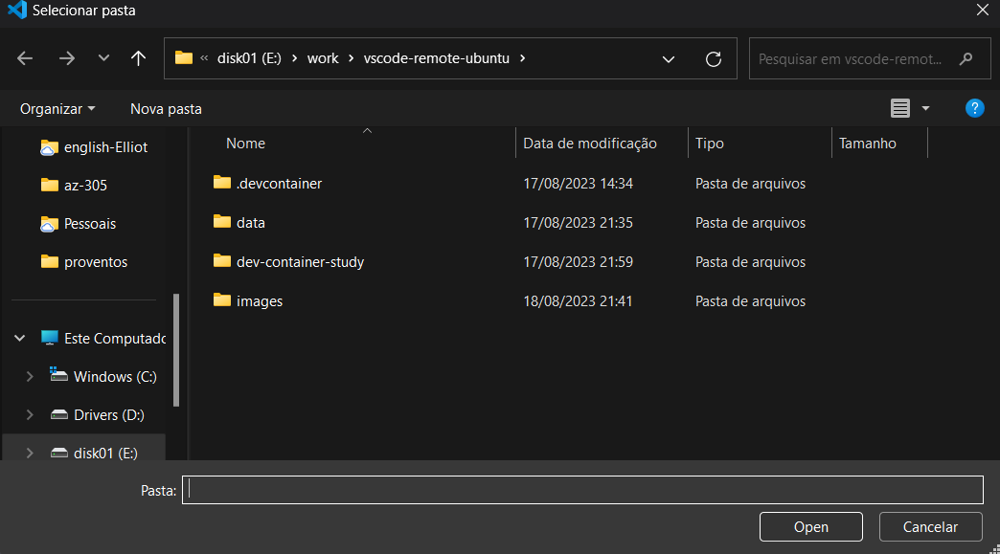

# Dev Container

[](https://vscode.dev/redirect?url=vscode://ms-vscode-remote.remote-containers/cloneInVolume?url=https://github.com/edtroleis/vscode-devcontainer-ubuntu)

A **development container** is a running container with a well-defined tool/runtime stack and its prerequisites.

The Visual Studio Code Dev Containers extension lets you use a container as a full-featured development environment. It allows you to open any folder inside (or mounted into) a container and take advantage of Visual Studio Code's full feature set.

# Softwares installed in dev container

- [Terraform](https://www.terraform.io/)
- [terraform-docs](https://terraform-docs.io/)
- [tflint](https://github.com/terraform-linters/tflint-ruleset-azurerm)
- [checkov](https://www.checkov.io/)
- [Infracost](https://www.infracost.io/)
- [Azure CLI](https://learn.microsoft.com/en-us/cli/azure/install-azure-cli)
- [docker cli](https://docs.docker.com/engine/reference/commandline/cli/)
- [kubectl](https://kubernetes.io/docs/tasks/tools/install-kubectl-linux/)
- [helm](https://helm.sh/)
- [Packer](https://www.packer.io/)
- [Ansible](https://www.ansible.com/)
- [Argo CD](https://argoproj.github.io/cd/)

# Dev container configuration files

- [Dockerfile](./.devcontainer/Dockerfile)
- [devcontainer.json](./.devcontainer/devcontainer.json)

# Setting up the dev container

## 1. Requirements

- [vscode](https://code.visualstudio.com/)
- [dev container extension](https://marketplace.visualstudio.com/items?itemName=ms-vscode-remote.remote-containers)
- Docker

## 2. Clone dev container code

```
git clone ...
```

## Run dev container

- In vscode > ctrl + shift + p > Dev Container: Open Folder in Container...


- Select cloned dev container code



# References

- [Devloping inside a container](https://code.visualstudio.com/docs/devcontainers/containers)
- [Templates](https://containers.dev/templates)
- [Using images, Dockerfiles, and Docker Compose](https://containers.dev/guide/dockerfile)

# Notes

- [Notes](NOTES.md)
